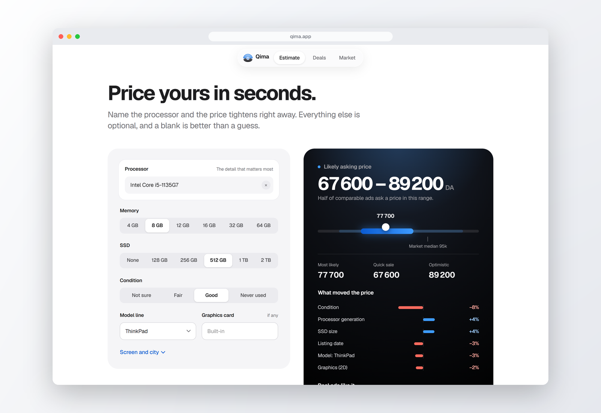
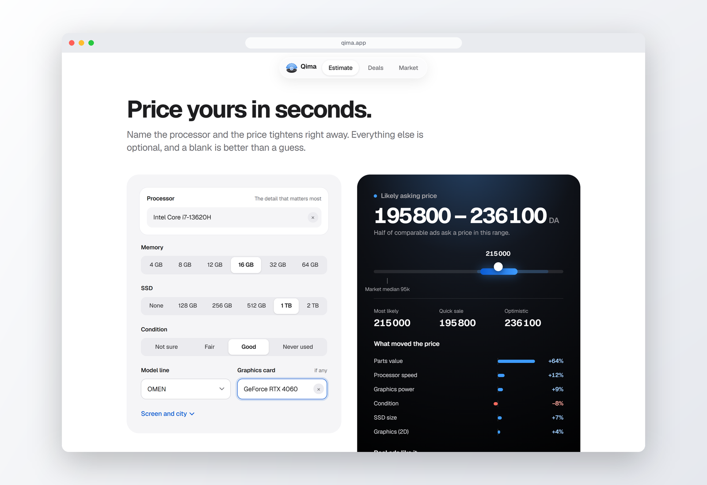
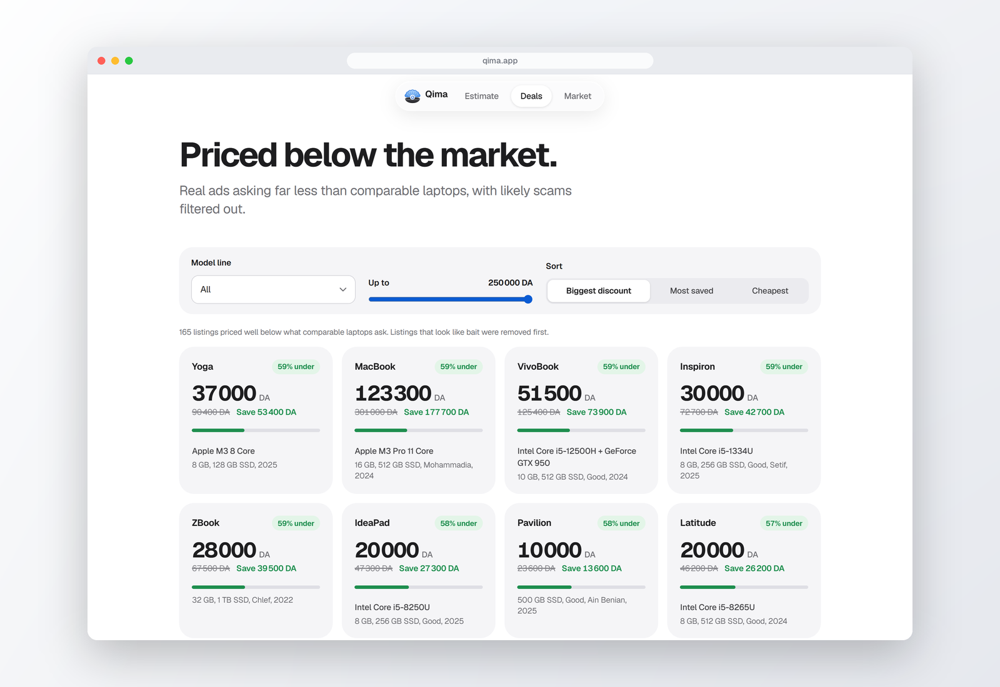
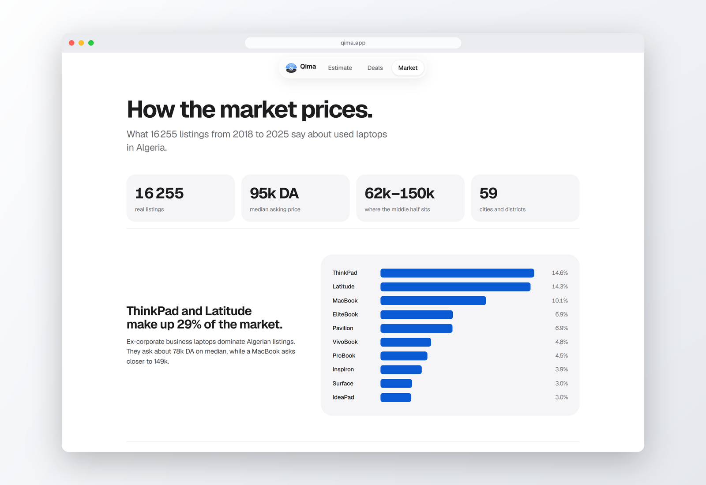
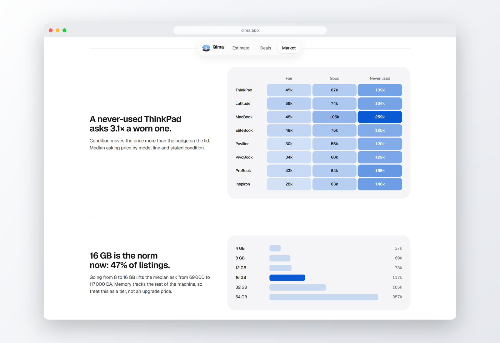

<p align="center">
  
</p>

<h1 align="center">Qima · Laptop Price Intelligence</h1>

<p align="center">
  <b>What's your laptop worth?</b><br>
  Fair asking prices for used laptops in Algeria, learned from 16,000 real listings.
</p>

<p align="center">
  
</p>

Price intelligence for the Algerian second-hand laptop market, built from ~16,000 scraped
Ouedkniss listings. Qima (قيمة, "value") estimates what a laptop would be listed for as a
tight, calibrated range, explains what moved the estimate, and surfaces listings priced well
below what comparable machines fetch.

> **It predicts asking price, not sale price.** Every row of training data is an *asking*
> price. The gap between what a seller asks and what they accept is real and unmeasured here.

---

## What's new

### A range you can act on

The estimate used to be the model's raw 10th–90th percentile band. On held-out listings it
covered only 69% of real prices while being up to **127% of the price wide**. A ThinkPad
could come back as "59,000–110,000 DZD".

The headline range is now a **calibrated 50% band**: half of comparable ads fall inside it.
It is centred on the point estimate and scaled by the model's own uncertainty, with the
scale fitted on the held-out test fold and checked on a separate half.

| Request | Median error | Band coverage (held out) | Typical width | Widest |
|---|---|---|---|---|
| Processor named (`cpu_name`) | **10.6%** | 49.9% | ±12% | ±14% |
| Benchmark score only | 27% | 50% | ±30% | ±30% |

Naming the processor is what tightens the range. The training pipeline prices a build from
its CPU and GPU (`estimated_component_cost`), so the API now accepts `cpu_name` / `gpu_name`
and derives the benchmarks, family, generation, integrated GPU and build cost from them
([`catalog.py`](src/laptop_price/catalog.py)). The same ThinkPad now comes back as
**67,600–89,200 DZD**. The raw band is still returned as `wide_range_dzd`.

### A new web app

[`web/`](web/) is a Next.js front end with an Apple-inspired design and its own identity.
The logo is a laptop that opens like a scallop shell, holding a pearl with a processor in
it: the processor is the part that moves a laptop's price most.

- **Estimate.** Prices live as you edit, with a searchable list of the 643 processors and
  102 graphics cards seen in the listings, the factors that moved the price, and real ads
  like yours.
- **Deals.** Listings priced far below comparable machines, with likely scams filtered out.
- **Market.** Charts led by findings from the data, such as condition moving the price more
  than the model line.

---

## Screenshots

| | |
|---|---|
|  |  |
| **Home.** The lid opens on scroll to reveal a live price range. | **Estimate.** Pick the processor and the range tightens as you type. |
|  |  |
| **A gaming laptop.** Core i7-13620H + RTX 4060: 195,800–236,100 DZD. | **Deals.** Real ads asking far below comparable laptops. |
|  |  |
| **Market.** Who sells what, and for how much. | **Condition.** A never-used ThinkPad asks 3.1× a worn one. |

---

## Quickstart

Everything runs in Docker; the only host requirement is Docker itself.

```bash
make build       # build the image (~5 min, pinned dependency stack)
make train       # build features, train, and write models/<version>/
make serve       # API on :8000, UI on :8501
```

Then open <http://localhost:8501> for the Streamlit app, or <http://localhost:8000/docs> for
the API. `make help` lists every target.

### The web app

```bash
make serve                        # the API on :8000 (or: uvicorn laptop_price.api.main:app --port 8000)
cd web && npm install && npm run dev
```

Open <http://localhost:3000>. The site calls the API through a `/api` proxy; set `API_URL`
if it is not on `http://127.0.0.1:8000`. Market charts, deals and the parts catalog are
static JSON in `web/public/data/`; refresh them after retraining with
`python scripts/export_web_data.py`.

---

## Results

| Split | R² | MAE (DZD) | Median APE |
|---|---|---|---|
| Stratified random *(comparable to the original report)* | **0.846** | **18,126** | 10.4% |
| Grouped by spec signature | 0.810 | 17,999 | 10.5% |
| **Time-based — train ≤ 2024, test 2025 (headline)** | **0.817** | **21,051** | **12.1%** |

Against the original course model (R² 0.827, MAE 21,070 on a random split), **MAE fell 14%**
— from restoring three columns the original pipeline deleted, not from a fancier model.

The time-based number is lower than the random-split number, and that is the point: listings
span 2018–2025 and carry seven years of dinar inflation and tech depreciation, so a random
split lets the model interpolate within periods it has already seen. The time-based figure is
the one that answers *"can we price a laptop listed tomorrow?"*

### Baselines it has to beat

| Baseline | R² | MAE (DZD) | Median APE |
|---|---|---|---|
| Global median | −0.107 | 63,033 | 42.1% |
| Median of identical spec | 0.074 | 51,194 | 27.8% |
| Component-cost sum | 0.095 | 49,617 | 24.2% |

### The ceiling

Identical configurations in this dataset sell **2–9× apart**. Predicting the perfect
per-configuration mean would cap out near R² 0.95 in log space. Most of the remaining error
is not in the spec columns at all — it lives in listing text, seller reputation, photos,
negotiability and urgency, none of which were scraped. That is why the model outputs a
**range**, not a single number.

---

## What's here

```
data/
  raw/         original scrape + CPU/GPU benchmark and price tables (never written to)
  mappings/    CPU → DDR type, CPU → storage, CPU name corrections
  interim/     per-stage intermediates
  processed/   pre_processed_data.csv, model_ready_data.csv, features.csv
notebooks/
  01–08        the original pipeline, renumbered into execution order
  09           anomaly detection (new — the deliverable the brief asked for)
  legacy/      the superseded split notebooks, kept for provenance
src/laptop_price/
  cleaning/    price, memory, screen, CPU normalisation — pure, tested functions
  features/    the model-ready matrix and its pandera contract
  models/      one end-to-end Pipeline, training, versioned artifact registry
  anomaly/     scam detection, deal ranking, spec-consistency checks
  evaluation/  metrics, baselines, the three split strategies
  api/  app/   FastAPI service and Streamlit UI
  catalog.py   CPU/GPU lookups: name a part, get its benchmarks and build cost
  serving.py   one definition of a request, the calibrated range, SHAP explanations
web/           Next.js front end (Qima)
scripts/       export_web_data.py writes the web app's static JSON
assets/        logo, title image and screenshots used in this README
models/        versioned bundles; `latest` points at the current one
reports/       the three PDFs, the presentation, mined rules, executed notebooks
docs/          architecture, data dictionary, modelling, deployment, audit, roadmap
tests/         236 tests over the parsers, splits, metrics, ranges and the artifact round-trip
```

---

## Pipeline

```
data/raw/data.csv
     │  notebooks/01_preprocessing.ipynb   (CPU/GPU matching, RAM, screen, price units)
     ▼
data/processed/pre_processed_data.csv
     │                                    │
     │ notebooks/03 (original encoding)   │ laptop_price.data.build_model_ready()
     ▼                                    ▼
model_ready_data.csv                  features.csv
     │                                    │
     │ notebooks/04, 05                   │ make train
     ▼                                    ▼
 original results                    models/<version>/price_pipeline.joblib
```

Both model-ready tables are kept deliberately. `model_ready_data.csv` reproduces the original
course artifact exactly; `features.csv` carries the repairs described below and is what the
service uses.

---

## What changed, and why

Full detail in [`docs/audit.md`](docs/audit.md); the short version:

| Fix | Effect |
|---|---|
| Restored `city`, `created_at`, `model_name` | The largest single accuracy win |
| `spec_Etat` missing encoded as **NaN**, not 0 | 41% of rows were being placed at the bottom of a 1–2–3 scale when their true price level sits mid-scale |
| Rescoped the price-unit correction | Feature-derived estimates now touch the target on **247 rows (1.6%)** instead of 826, and every one is flagged `price_unit_ambiguous` |
| Troll-price filter actually applied | 62 placeholder prices (`111111`, `99999`, …) removed; the filter existed but was dead code |
| One `sklearn.Pipeline` artifact | Replaces three mismatched pickles — a scaler expecting 14 features next to a model expecting 10, with the model trained unscaled |
| MAPE / median APE + three baselines | "Typically within 12%" is the number a user understands |
| Group-aware and time-based splits | Confirms duplicates were not inflating the score, and gives an honest headline |
| Anomaly detection built | The missing deliverable — scam detection, a deal finder, and spec-consistency checks |

Excluding the unit-ambiguous rows from the test set moves R² by 0.0001, which converts the
sharpest methodological criticism of the original into a demonstrated non-issue.

---

## Using it

```bash
make predict ARGS="--ram 16 --ssd 512 --cpu-mark 19776 --gpu-mark 16758 --brand THINKPAD"
make deals                 # today's candidate bargains
make test                  # 236 tests
make verify                # prove the repo matches the original project folder
make notebooks             # execute all 9 notebooks top-to-bottom
```

```bash
curl -X POST localhost:8000/predict -H 'Content-Type: application/json' \
  -d '{"cpu_name":"Intel Core i5-1135G7 @ 2.40GHz","ram_gb":8,"ssd_gb":512,
       "brand":"THINKPAD","condition":2,"listing_year":2025}'
```

```json
{
  "estimate_dzd": 77700.0,
  "range_dzd": [67600.0, 89200.0],
  "range_coverage": 0.5,
  "precision": "high",
  "wide_range_dzd": [58700.0, 109500.0],
  "model_version": "v20260912T2037"
}
```

`GET /catalog` lists the processor and graphics names `/predict` understands.

---

## Documentation

| Document | What it covers |
|---|---|
| [`docs/architecture.md`](docs/architecture.md) | How the pieces fit together |
| [`docs/pipeline.md`](docs/pipeline.md) | Each stage, its inputs and outputs, how to re-run it |
| [`docs/data-dictionary.md`](docs/data-dictionary.md) | Every column: source, unit, null rate, known issues |
| [`docs/modeling.md`](docs/modeling.md) | Features, splits, metrics, baselines, results |
| [`docs/model-card.md`](docs/model-card.md) | Intended use and limitations |
| [`docs/api.md`](docs/api.md) | Endpoint reference |
| [`docs/deployment.md`](docs/deployment.md) | Docker, configuration, operations |
| [`docs/audit.md`](docs/audit.md) | What was wrong with the original, with evidence |
| [`docs/roadmap.md`](docs/roadmap.md) | Where this goes next |
| [`CHANGELOG.md`](CHANGELOG.md) | What changed in this revision |

---

## License

MIT.
